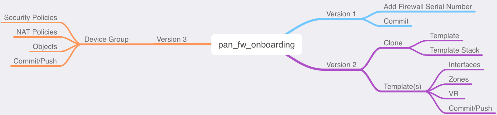

# pan_fw_onboarding
A script to assist with firewall onboarding configurations



## Built With

[Docker](https://www.docker.com/products/docker-desktop)  
[Palo Alto Networks PAN-OS SDK for Python](https://github.com/PaloAltoNetworks/pan-os-python)

## Deployment

All files within the folder should be deployed in the same directory for proper file execution.

## Prerequisites

Update `config.py` file with correct values before operating.

```
# CONNECTIVITY CONFIGURATIONS
# Update the panorama_ip section with the primary and secondary Panorama 
# IP addresses.

paloalto = {
    'username': '<USERNAME>',
    'password': '<PASSWORD>',
    'key': '<API_KEY>',
    'panorama_ip': ['<IP_ADDRESS1>', '<IP_ADDRESS2>']
    }

# FIREWALL SERIAL NUMBER(S)
# Enter the firewall serial number(s) to be added to Panorama.
#
# Single Serial Number: ['<SERIAL_NUMBER>']
# Multiple Serial Numbers: ['<SERIAL_NUMBER1>', '<SERIAL_NUMBER2>']

serial_number = ['<SERIAL_NUMBER>']
```

## Operating

From the CLI, change directory into the folder containing the files.  The following command will execute the script:

```bash
docker-compose up
```

After the script has completed or if the script needs to be reran, issue the following command:

```bash
docker-compose down --rmi all
```

## Changelog

See the [CHANGELOG](CHANGELOG) file for details

## License

This project is licensed under the MIT License - see the [LICENSE](LICENSE) file for details
